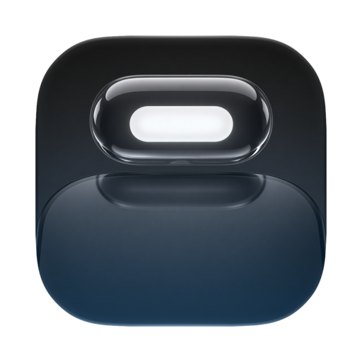
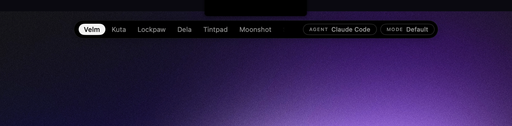

<div align="center">



# Tintpad

**It falls out of your notch.**

Press a hotkey and a black drop falls from the camera housing with your repos
inside. Return opens your terminal at that repo with Claude Code, Codex, or
whatever you run, already going.

[](https://github.com/sorkila/tintpad/actions/workflows/ci.yml)
&nbsp;
&nbsp;
&nbsp;

</div>

---

Press <kbd>⌥⌘Space</kbd>. Arrow or type to a repo. Hit <kbd>↵</kbd>. Your real terminal
opens there with the agent running, in under two seconds, without the mouse.

**Think ⌘Tab, for repos.** A black drop falls out of the notch with your projects inside, each with its
own tint, ranked by how you actually work. It hands off to the terminal you already use.
It doesn't try to be one.

> Not a usage monitor. Not an IDE. Not a terminal. The launcher the agent menu-bar apps forgot.

<div align="center">
  
</div>

The chips are the contract: `AGENT Claude Code · MODE Default` — exactly what ↵ will
run, in the agent's own words. Nothing happens that the chips didn't announce, and a
mode that skips permissions is a red chip before you ever press ↵.

<!-- Animated demo: record per docs/DEMO.md and drop at docs/assets/demo.gif. -->

## Why

GUI apps don't inherit your shell `PATH`, so double-clicking an app can't find
`claude` or `codex`. Repo-switching is friction. Tintpad fixes both: it resolves your
login-shell `PATH` once, ranks repos by frecency, and hands the command to your terminal
at the right directory. The boring 2-second thing you do twenty times a day, gone.

## Install

**[Download the latest signed, notarized `Tintpad.dmg`](https://github.com/sorkila/tintpad/releases/latest/download/Tintpad.dmg)**,
drag it to Applications, and launch. macOS 14+.
(Or browse all [releases](https://github.com/sorkila/tintpad/releases).)

Or with Homebrew:

```sh
brew install --cask sorkila/tap/tintpad
```

Or build from source (macOS 14+, Swift 6 toolchain / Xcode 16+):

```sh
git clone https://github.com/sorkila/tintpad.git
cd tintpad
swift run                  # dev run
./Scripts/package.sh       # build Tintpad.app into .build/release
```

## Features

- **Frecency repo search**, your most-used repos rise to the top, zoxide-style, and
  Tintpad **remembers how you opened each repo last** (agent and mode), so ↵ repeats it.
- **Git-aware**, worktree creation and branch context are checked in the background,
  so the drop never waits on git.
- **<kbd>⌘0</kbd> resume** replays your last session exactly, from the palette or a
  global hotkey.
- **Hands off to 7 terminals**, Ghostty, iTerm2, kitty, WezTerm, Alacritty, Terminal, Warp.
- **Run modes in each agent's own words**, Default and Skip permissions for Claude
  Code, Untrusted, Default, and Full access for Codex. A mode that skips permissions is
  a red chip, and (optionally) requires a confirm — on every path, including dispatch
  and resume.
- **Worktrees**, <kbd>⌃W</kbd> spins up an isolated branch checkout and launches the agent in it.
- **Headless dispatch**, <kbd>⌃↵</kbd> runs an agent in the background and notifies you when it's done.
- **Prompt library, per-repo presets, GitHub import, open-in-editor.**
- **Keyboard-first and accessible**, Dynamic Type in the palette, VoiceOver labels and
  announcements, Reduce Motion and Reduce Transparency honored, and Tab left alone for
  focus traversal when assistive tech needs it.
- **Local-only.** No accounts, no telemetry, nothing leaves your Mac.

## Keys

| Key | Action |
|---|---|
| <kbd>⌥⌘Space</kbd> | Summon (change in Settings → Hotkeys) |
| <kbd>←</kbd> <kbd>→</kbd> / <kbd>↑</kbd> <kbd>↓</kbd> | Move through your repos |
| <kbd>↵</kbd> | Launch what the chips say |
| <kbd>⌘0</kbd> | Resume the last session exactly |
| <kbd>⌘1</kbd>–<kbd>⌘9</kbd> | Jump straight to the nth repo and launch it |
| <kbd>⌘↵</kbd> | Open repo in editor |
| <kbd>⌥↵</kbd> | Launch the dangerous mode |
| <kbd>⇧↵</kbd> | Launch the safest mode |
| <kbd>⌃↵</kbd> | Headless dispatch |
| <kbd>⌃W</kbd> | New worktree |
| <kbd>⇥</kbd> / <kbd>⇧⇥</kbd> | Cycle agent / mode |
| <kbd>⌘L</kbd> · <kbd>⌘P</kbd> | Inline prompt · cycle saved prompt |
| <kbd>⌘R</kbd> · <kbd>Esc</kbd> | Re-scan repos · close |

## Configure

Agents are just command templates with variables, set them in **Settings → Agents**:

```
claude {mode} {prompt}
```

Variables: `{repoPath}` `{repoName}` `{branch}` `{remote}` `{prompt}` `{mode}` `{shell}` `{worktreePath}`.
Every interpolated value is sanitized and shell-quoted before it runs.

## Contributing

PRs welcome, **especially new terminal adapters**, which are about one protocol and one
struct. See [CONTRIBUTING.md](CONTRIBUTING.md) and [docs/ARCHITECTURE.md](docs/ARCHITECTURE.md).

## Pairs with

[Lockpaw](https://getlockpaw.com) is the other half of the loop. Tintpad starts your agents per repo, Lockpaw covers your screen while they run and glows when one needs you. Also free, also MIT.

## Support

Tintpad is **free and MIT**, the whole thing. If it earns a spot in your day, leave a tip:
[**Buy me a coffee →**](https://www.buymeacoffee.com/eriknielsen). Supporters get custom
tinted chips (the selected repo's chip blooms in its own hue) and my thanks, that's the
only difference. To claim it, tip then email
your receipt to [erik@sorkila.com](mailto:erik@sorkila.com) and I'll send you an unlock key
(it verifies offline, no account).

## License

[MIT](LICENSE) © 2026 Erik Nielsen ([Sörkila](https://sorkila.com)).
